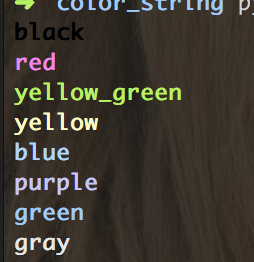

# get string with color

## install
  ```bash
    pip install color_string
``` 

## usage
```python
import color_string as cs


     color_list = [cs.BLACK, cs.RED, cs.YELLOW_GREEN, cs.YELLOW, cs.BLUE, cs.PURPLE, cs.GREEN, cs.GRAY]
     for color in color_list:
        print (cs.get_color(color, color))
```


## test

```bash
 python color_string.py
```
